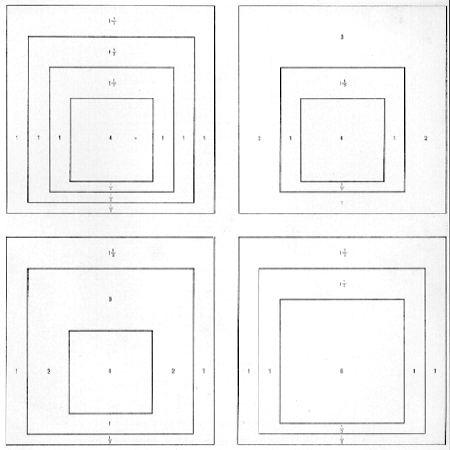

# Josef Albers bot 🤖🎨

[@AlbersBot](https://twitter.com/AlbersBot) is a Twitter bot that tweets a new generative art picture in the style of Josef Albers and his *Homage to the Square* series.

This bot generates a Canvas picture with three or four squares, by choosing at random one of the four formats used by Albers, and filling each square with a random colour.

## *Homage to the Square*

*Homage to the Square* is a series of paintings and prints by Josef Albers, begun in 1950 and continued until his death in 1976. In this series, Albers explored chromatic interactions and variations, using always one of four different compositional schemes of three or four squares set inside each other.

>"For me colour is the means of my idiom. It’s automatic." Josef Albers, 1966

# Usage

To test the bot locally, you will need a [Twitter developer account](https://developer.twitter.com/), and [Twitter app API keys and user access tokens](https://developer.twitter.com/en/docs/basics/apps/guides/the-app-management-dashboard)

Create and an `.env` file and set the environment variables for the following API keys : 'consumer_key', 'consumer_secret', 'access_token', 'access_token_secret'. 

Run `node bot.js` to send a tweet.

